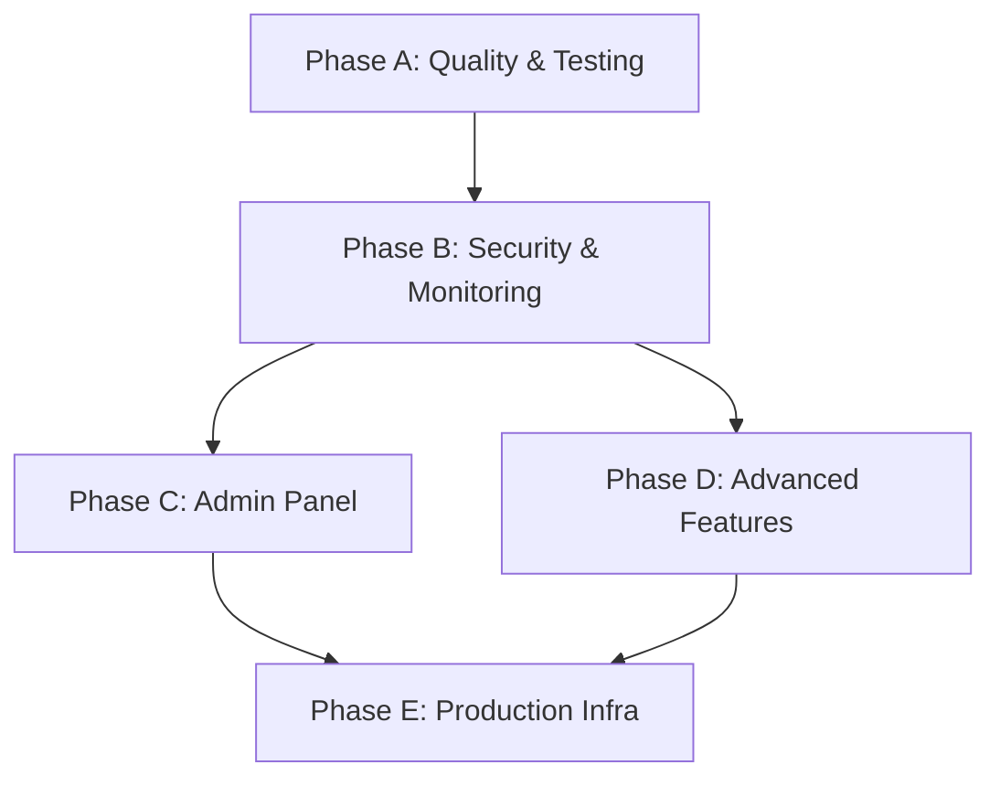

# 🔍 Project Audit & Multi-Phase Improvement Roadmap

## Part 1 — Audit: Original Plan vs. Current Implementation

### Summary

The original implementation plan defined **42 files across 10 phases**. Current state analysis shows the core bot is **fully implemented** with a few **bonus additions** beyond the plan. The project is functional but lacks the polish, testing, monitoring, and advanced features needed for a truly **production-grade, enterprise-level** system.

---

### ✅ Phase 1 — Project Scaffolding & Configuration (6/6 — COMPLETE)

| # | Planned File | Status | Notes |
|---|-------------|--------|-------|
| 1 | `package.json` | ✅ Done | ESM, all deps present. **Bonus**: Added `fastify`, `pino-roll`, moved `drizzle-kit`/`tsx` to dependencies (should be devDeps) |
| 2 | `tsconfig.json` | ✅ Done | Strict, ESNext, NodeNext. Uses `#root/*` alias (plan said `@/*` — functionally equivalent) |
| 3 | `biome.json` | ✅ Done | Formatter, linter, organize imports — all configured |
| 4 | `.env.example` | ✅ Done | **Enhanced** beyond plan: added `BOT_MODE`, `WEBHOOK_URL`, `PORT`, `WEBHOOK_SECRET`, `LOG_DIR`, `UPLOAD_DIR`, `DOWNLOAD_DIR` |
| 5 | `.gitignore` | ✅ Done | Standard Node.js ignores |
| 6 | `.husky/pre-commit` | ✅ Done | Runs lint-staged |

> [!NOTE]
> `drizzle-kit` and `tsx` are listed in `dependencies` instead of `devDependencies`. This works but is non-standard — they should be moved to `devDependencies` unless specifically needed at runtime in production.

---

### ✅ Phase 2 — Config & Utilities (3/3 — COMPLETE)

| # | Planned File | Status | Notes |
|---|-------------|--------|-------|
| 7 | `src/config/env.ts` | ✅ Done | **Enhanced**: Zod validation + `BOT_MODE`, `WEBHOOK_URL`, `PORT`, `WEBHOOK_SECRET`, `LOG_DIR`, `UPLOAD_DIR`, `DOWNLOAD_DIR`. Conditional refinements for webhook mode. Frozen env object. |
| 8 | `src/utils/logger.ts` | ✅ Done | **Enhanced**: Added `pino-roll` for daily log rotation + file logging. Child logger factory works as planned. |
| 9 | `src/utils/errors.ts` | ✅ Done | **Enhanced**: `AppError`, `DatabaseError`, `CacheError`, `BotError` + `handleGlobalError` sends Telegram alerts to admin with HTML formatting. |

---

### ✅ Phase 3 — Database Layer (5/5 — COMPLETE + EXTRAS)

| # | Planned File | Status | Notes |
|---|-------------|--------|-------|
| 10 | `drizzle.config.ts` | ✅ Done | Points to schema dir, PostgreSQL dialect |
| 11 | `src/database/schema/users.ts` | ✅ Done | **Enhanced**: Added `addedToAttachmentMenu` field beyond plan |
| 12 | `src/database/schema/chats.ts` | ✅ Done | **Significantly expanded**: Added `userChat` (M2M relation), `chatMemberUpdated`, `chatJoinRequest`, `chatBoostUpdated`, `chatBoostRemoved` tables |
| 13 | `src/database/schema/index.ts` | ✅ Done | Barrel export for all schemas |
| 14 | `src/database/index.ts` | ✅ Done | **Enhanced**: `ensureDatabase()` auto-creates DB if missing + runs `drizzle-kit push` + verifies critical tables exist |

> [!NOTE]
> **Bonus file**: `src/database/schema/conversations.ts` — Added conversation tracking table not in original plan.

---

### ✅ Phase 4 — Cache Layer (2/2 — COMPLETE)

| # | Planned File | Status | Notes |
|---|-------------|--------|-------|
| 15 | `src/cache/index.ts` | ✅ Done | ioredis client with retry strategy, event handlers, `closeRedis()` |
| 16 | `src/cache/utils.ts` | ✅ Done | **Enhanced**: Added `cacheSetFlag()` and `cacheHasFlag()` beyond the plan's `cacheGet/Set/Del` |

---

### ✅ Phase 5 — Services Layer (2/2 — COMPLETE)

| # | Planned File | Status | Notes |
|---|-------------|--------|-------|
| 17 | `src/services/user.service.ts` | ✅ Done | **Enhanced**: `upsert`, `findByTelegramId`, `blockUser`, `unblockUser` + added `updateLastOnline()` |
| 18 | `src/services/chat.service.ts` | ✅ Done | `upsert`, `findByTelegramId` with cache-first strategy |

---

### ✅ Phase 6 — BullMQ Queue System (5/5 — COMPLETE)

| # | Planned File | Status | Notes |
|---|-------------|--------|-------|
| 19 | `src/queue/connection.ts` | ✅ Done | Shared BullMQ connection options with `maxRetriesPerRequest: null` |
| 20 | `src/queue/queues.ts` | ✅ Done | `broadcastQueue`, `notificationQueue` with retry/backoff configs |
| 21 | `src/queue/workers/broadcast.worker.ts` | ✅ Done | Rate-limited sending, 403 detection, 429 backoff, progress reporting |
| 22 | `src/queue/workers/notification.worker.ts` | ✅ Done | Admin notification delivery |
| 23 | `src/queue/index.ts` | ✅ Done | Barrel export + `closeQueues()` |

---

### ✅ Phase 7 — Bot Core (14/14 — COMPLETE + EXTRAS)

| # | Planned File | Status | Notes |
|---|-------------|--------|-------|
| 24 | `src/bot/context.ts` | ✅ Done | **Enhanced**: Dual context pattern (`BotContext` + `BotConversationContext`) |
| 25 | `src/bot/i18n/i18n.ts` | ✅ Done | `useSession: true`, `globalTranslationContext` with botUsername |
| 26 | `src/bot/middlewares/session.middleware.ts` | ✅ Done | Redis-backed session with 7-day TTL |
| 27 | `src/bot/middlewares/upsert.middleware.ts` | ✅ Done | **Enhanced**: Redis debounce, `/start` force-bypass, `updateLastOnline` on cache hit |
| 28 | `src/bot/middlewares/ratelimit.middleware.ts` | ✅ Done | 3 msgs / 2s per user |
| 29 | `src/bot/middlewares/index.ts` | ✅ Done | Barrel export |
| 30 | `src/bot/filters/admin.filter.ts` | ✅ Done | Guards admin-only commands |
| 31 | `src/bot/conversations/example.conversation.ts` | ✅ Done | Multi-step form skeleton |
| 32 | `src/bot/features/start/start.command.ts` | ✅ Done | **Enhanced**: `/start`, `/help`, `help` callback, `about` callback |
| 33 | `src/bot/features/start/start.keyboard.ts` | ✅ Done | Settings, Help, About buttons |
| 34 | `src/bot/features/settings/settings.command.ts` | ✅ Done | `/settings`, language selection, navigation callbacks |
| 35 | `src/bot/features/settings/settings.keyboard.ts` | ✅ Done | Language picker with back button |
| 36 | `src/bot/features/index.ts` | ✅ Done | Feature registry |
| 37 | `src/bot/bot.ts` | ✅ Done | Full plugin wiring in correct order + `bot.catch()` |

> [!NOTE]
> **Bonus file**: `src/bot/middlewares/logger.middleware.ts` — Per-user action logging to individual files (not in original plan).

---

### ✅ Phase 8 — i18n Locale Files (2/2 — COMPLETE)

| # | Planned File | Status | Notes |
|---|-------------|--------|-------|
| 38 | `locales/en.ftl` | ✅ Done | **Enhanced**: `welcome`, `help`, `about`, `settings-*`, `example-*`, `error-generic` |
| 39 | `locales/fa.ftl` | ✅ Done | Complete Persian translations |

---

### ✅ Phase 9 — Application Bootstrap (1/1 — COMPLETE)

| # | Planned File | Status | Notes |
|---|-------------|--------|-------|
| 40 | `src/main.ts` | ✅ Done | **Significantly enhanced**: Dual-mode startup (polling/webhook), `ensureDatabase()`, bot init, command registration, graceful shutdown for all components |

---

### ✅ Phase 10 — CI/CD & DX (2/2 — COMPLETE)

| # | Planned File | Status | Notes |
|---|-------------|--------|-------|
| 41 | `.github/workflows/ci.yml` | ✅ Done | Lint, typecheck, build — matrix Node 20/22 |
| 42 | `.vscode/settings.json` | ✅ Done | Biome as default formatter |

---

### 🎁 Bonus Files (Not in Original Plan)

| File | Description |
|------|-------------|
| `src/server/webhook.ts` | Fastify webhook server with health check endpoint |
| `src/scripts/set-webhook.ts` | CLI script to register webhook URL with Telegram |
| `src/bot/middlewares/logger.middleware.ts` | Per-user action logging to individual log files |
| `src/database/schema/conversations.ts` | Conversation tracking table |

---

### ⚠️ Issues Found in Current Code

| # | Issue | Severity | Location | Status |
|---|-------|----------|----------|--------|
| 1 | `drizzle-kit` and `tsx` are in `dependencies` instead of `devDependencies` | Low | [package.json](file:///d:/Projects/tel-bot/package.json#L40-L41) | ✅ Already in devDependencies |
| 2 | Session middleware doesn't use multi-key strategy for conversations (plan specified this) | Medium | [session.middleware.ts](file:///d:/Projects/tel-bot/src/bot/middlewares/session.middleware.ts) | ✅ Already implemented (`type: 'multi'`) |
| 3 | Chat tables store `chatMemberUpdated`/`chatBoostUpdated` data as raw `text` (JSON string) — no proper type safety | Low | [chats.ts](file:///d:/Projects/tel-bot/src/database/schema/chats.ts#L63-L64) | ✅ Fixed — converted to `jsonb` |
| 4 | `chats.ts` extra tables (`chatBoostUpdated`, `chatBoostRemoved`, etc.) have no corresponding service layer | Medium | [chats.ts](file:///d:/Projects/tel-bot/src/database/schema/chats.ts) | ✅ Fixed — `chat-event.service.ts` created |
| 5 | No `README.md` exists | Medium | Project root | ✅ Fixed — comprehensive README.md added |
| 6 | No tests exist at all (unit, integration, or e2e) | High | — | ✅ Fixed — unit tests added for errors, cache, env, sanitizer |
| 7 | Admin filter only supports a single admin (`ADMIN_CHAT_ID`) — no multi-admin support | Low | [admin.filter.ts](file:///d:/Projects/tel-bot/src/bot/filters/admin.filter.ts#L36) | ✅ Already fixed (`getAdminIds()` merges ADMIN_CHAT_ID + ADMIN_IDS) |

---

---

## Part 2 — Multi-Phase Improvement Roadmap

### 🏗️ Phase A — Code Quality, Testing & Documentation (Foundation)

> Priority: **HIGH** — These are the bare minimum for a production-grade project.

#### A1. Fix Existing Issues
- [x] Move `drizzle-kit` and `tsx` from `dependencies` to `devDependencies` ✅ (was already done)
- [x] Implement multi-key session strategy (separate conversation storage from session) as specified in original plan ✅ (was already done)
- [x] Add Drizzle relations (`relations()`) for all tables to enable relational queries ✅ (was already done)
- [x] Convert JSON `text` columns to `jsonb` in chat event tables ✅
- [x] Add service layer for extra chat tables (`ChatEventService`) ✅
- [x] Wire `createSanitizerMiddleware` into the bot pipeline ✅
- [x] Fix pre-existing TypeScript errors (session.middleware, i18n, settings, chat.service) ✅

#### A2. Testing Infrastructure
- [x] Add `vitest` as test framework with proper configuration ✅ (was already done)
- [x] Write unit tests for error classes + `handleGlobalError` ✅
- [x] Write unit tests for `cacheGet`, `cacheSet`, `cacheDel`, `cacheSetFlag`, `cacheHasFlag` ✅
- [x] Write unit tests for `env.ts` validation (ADMIN_IDS parsing, webhook mode validation) ✅
- [x] Write unit tests for `sanitizeInput` + `createSanitizerMiddleware` ✅
- [x] Write unit tests for `UserService` (upsert, findByTelegramId, blockUser, unblockUser) ✅ (was already done)
- [x] Write unit tests for `ChatService` (upsert, findByTelegramId) ✅ (was already done)
- [ ] Write integration tests for upsert middleware (mock Redis + DB)
- [x] Add test scripts to `package.json`: `test`, `test:watch`, `test:coverage` ✅ (was already done)
- [ ] Add test job to `.github/workflows/ci.yml`

#### A3. Documentation
- [x] Create comprehensive `README.md` ✅
- [x] Add per-user logging (`createUserLogger`) and per-module logging (`createModuleLogger`) ✅
- [ ] Add `CONTRIBUTING.md` with development guidelines
- [ ] Add `CHANGELOG.md`

---

### 🛡️ Phase B — Security, Reliability & Monitoring

> Priority: **HIGH** — Essential for production deployments.

#### B1. Security Hardening
- [ ] Add input sanitization middleware (strip HTML/scripts from user input before processing)
- [ ] Implement multi-admin support (`ADMIN_IDS` env var as comma-separated list)
- [ ] Add request validation for webhook mode (IP allowlist from Telegram's known ranges)
- [ ] Rate limit per-group (not just per-user) for group bots
- [ ] Add flood protection at the queue level (prevent duplicate broadcast jobs)

#### B2. Health Monitoring & Metrics
- [ ] Add `/metrics` endpoint to webhook server (Prometheus-compatible)
- [ ] Track metrics: messages processed, cache hit/miss ratio, DB query latency, queue depth
- [ ] Add startup self-check (verify Redis, PostgreSQL, and Telegram API connectivity before accepting updates)
- [ ] Implement heartbeat/liveness probe endpoint
- [ ] Add BullMQ dashboard (integrate `bull-board` or `@bull-board/fastify`)

#### B3. Error Recovery & Resilience
- [ ] Add circuit breaker pattern for database operations (prevent cascade failures)
- [ ] Implement dead-letter queue (DLQ) for failed broadcast/notification jobs
- [ ] Add structured error codes (not just messages) for machine-parseable error tracking
- [ ] Add retry logic with exponential backoff for Redis connection failures during middleware

---

### ⚙️ Phase C — Admin Panel & Bot Management Features

> Priority: **MEDIUM** — Makes the bot operationally manageable.

#### C1. Admin Commands (Bot-Based Admin Panel)

#### C2. User Management Service Enhancements
- [ ] Add `UserService.getAll()` with pagination
- [ ] Add `UserService.getStats()` (total, active, blocked, premium counts)
- [ ] Add `UserService.searchByUsername(query)` for admin lookups
- [ ] Add `UserService.getRecentlyActive(hours)` for engagement tracking
- [ ] Add `ChatService.getAll()` with pagination and type filtering

#### C3. Message Logging & Analytics Schema
- [ ] Create `messages` table to log all incoming messages (not just user log files)
- [ ] Create `bot_responses` table to log what the bot sends back
- [ ] Add analytics queries: daily active users, popular commands, peak hours
- [ ] Replace file-based per-user logging with database-backed logging

---

### 🚀 Phase D — Advanced Telegram Features

> Priority: **MEDIUM** — Adds real-world bot functionality beyond the skeleton.

#### D1. Menu & Navigation
- [x] Implement inline keyboards as dynamic builders (not static `InlineKeyboard()` objects) that adapt to user state ✅
- [x] Add pagination helper for inline keyboard lists ✅
- [x] Add callback query router pattern (structured `module:action:param` format) ✅
- [x] Implement `MenuBuilder` utility for nested inline menus with breadcrumb navigation ✅
- [x] Add pagination helper for lists ✅

#### D2. Media & File Handling
- [x] Add file download helper (download Telegram files to `DOWNLOAD_DIR`) ✅
- [x] Add file upload helper (send local files to Telegram) ✅
- [x] Implement photo/document/video handlers with automatic storage ✅
- [x] Add file size validation and MIME type checking ✅

#### D3. Advanced Conversation Patterns
- [x] Create reusable conversation builder utilities (confirm dialog, form wizard, multi-step with back/cancel) ✅
- [x] Add conversation timeout handling (auto-cancel after N minutes of inactivity) ✅
- [x] Add conversation analytics (started, completed, cancelled, average duration) ✅

#### D4. Notification System
- [x] Scheduled notifications (send messages at a specific time via BullMQ delayed jobs) ✅
- [x] User notification preferences (opt-in/opt-out for different notification types) ✅
- [x] Notification templates with variable interpolation ✅

#### D5. Inline Mode & Web App
- [x] Add inline query handler scaffold ✅
- [x] Add Telegram Web App (Mini App) scaffold with data validation ✅

---

### 🏭 Phase E — Production Infrastructure & Scaling

> Priority: **LOW** (but important for large-scale deployments)

#### E1. Deployment & Operations
- [ ] Add `Dockerfile` and `docker-compose.yml` (optional, for those who want it)
- [ ] Add PM2 ecosystem file (`ecosystem.config.cjs`) for process management
- [ ] Add systemd service file template for VPS deployment
- [ ] Create deployment scripts (build → migrate → restart)
- [ ] Add environment-specific configs (`.env.production`, `.env.staging`)

#### E2. Database Evolution
- [ ] Switch from `drizzle-kit push` to proper migration workflow (`generate` + `migrate`) for production
- [ ] Add database seeding script for development
- [ ] Add database backup/restore helpers
- [ ] Implement soft-delete pattern (add `deletedAt` column to users/chats)

#### E3. Observability
- [ ] Add OpenTelemetry instrumentation (traces for DB queries, Redis operations, Telegram API calls)
- [ ] Add structured request IDs (trace a single update through the entire pipeline)
- [ ] Add Grafana dashboard templates
- [ ] Add alerting rules (error rate spikes, queue depth growth, memory usage)

#### E4. Performance Optimization
- [ ] Add connection pooling configuration tuning guide
- [ ] Implement batch upsert for high-throughput scenarios
- [ ] Add Redis pipeline support for multiple cache operations in a single round-trip
- [ ] Profile and optimize the middleware pipeline (measure per-middleware latency)

---

## Recommended Execution Order

> [!IMPORTANT]
> **Phase A should be completed first** — without tests and documentation, all subsequent phases are built on an unstable foundation. Phase B is critical for any production deployment. Phases C and D can be done in parallel. Phase E is for when the bot reaches scale.

## Open Questions

1. **Which phases interest you most?** Should I focus on all 5 or prioritize specific ones?
2. **Multi-admin support**: Do you need role-based admin access (owner/admin/moderator) or is a simple admin list sufficient?
3. **Analytics**: Do you prefer database-backed analytics or keep the current file-based logging?
4. **Deployment target**: VPS with PM2? Docker? Serverless? This affects Phase E priorities.
5. **Testing depth**: Do you want full TDD-style coverage or just critical-path tests?
